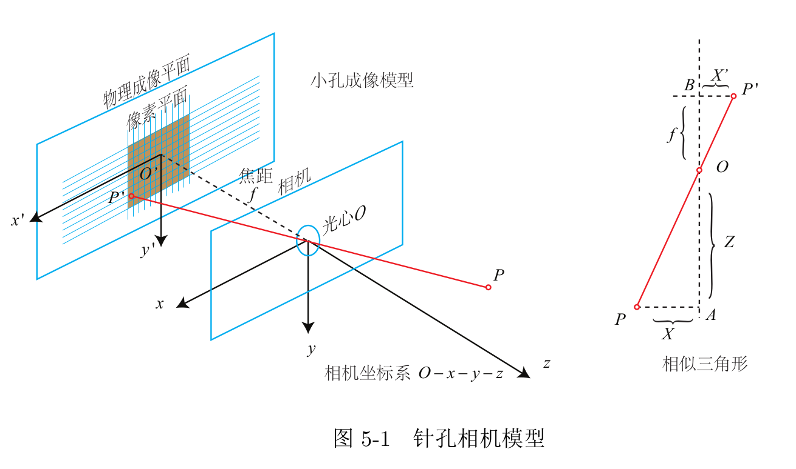

### 相机成像模型

小孔成像:

以世界坐标系单位有:
$$
\frac Zf = \frac X{X^`} = \frac Y{Y^`}
$$

得到

之后按照物理坐标到像素坐标的关系有:
$$
\begin{equation}\begin{split} 
u&= \alpha*X^` +cx = \alpha*f*\frac XZ +cx= \frac{\alpha*f}Z* X +cx   \\
v&= \beta* Y^`+ cy= \alpha*f*\frac YZ +cx = \frac{\alpha*f}Z*Y+cx   \\
\end{split}\end{equation}
$$
化为齐次矩阵有
$$
\begin{pmatrix}
u\\
v\\
1\\
\end{pmatrix}
=\frac1Z*
\begin{pmatrix}
\alpha*f &0&cx\\
0 & \beta * f & cy\\
0 & 0 & 1\\
\end{pmatrix}
\begin{pmatrix}
X\\Y\\Z
\end{pmatrix}
＝\frac1ZKP
$$
这里f是物理焦距,a是像素每米,**a *ｆ= fx就代表实际物理焦距对应的像素焦距**;P代表像空间坐标系，根据在世界坐标系下的相机位姿RT有：
$$
P = [R  \ T]P_w = T P_w
$$

$$
\begin{pmatrix}
u\\
v\\
1\\
\end{pmatrix}
=\frac1Z*
\begin{pmatrix}
\alpha*f &0&cx\\
0 & \beta * f & cy\\
0 & 0 & 1\\
\end{pmatrix}
\begin{pmatrix}
R_{3*3}  \ T_{3*1}
\end{pmatrix}
\begin{pmatrix}
X\\Y\\Z\\1
\end{pmatrix}
$$

该公式为**重投影误差公式**，联系了不同相片上的同名点。

现在我们总结了像平面坐标系，像空间坐标系和世界坐标系．

像空间归一化齐次坐标

https://blog.csdn.net/bufengzj/article/details/103336170

不知道指的是不是像平面像素坐标
$$
P^` =\  \frac PZ =
\begin{pmatrix}
\frac XZ\\\frac Y Z \\1
\end{pmatrix}
$$

简单来说，就是方便转换，归一化平面坐标　乘上距离Z,就转换到了世界物理坐标（以相机位置为坐标系），乘上焦距ｆ，就转换到了成像坐标。

