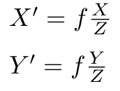

### ORB-SLAM-EH计算

https://blog.csdn.net/xiaoxiaowenqiang/article/details/79278884

并行计算基础矩阵和单应矩阵

```c++
　　// 计算 单应矩阵 homograpy 并打分
	    thread threadH(&Initializer::FindHomography,this,ref(vbMatchesInliersH), ref(SH), ref(H));
	    // 计算 基础矩阵 fundamental matrix并打分
	    thread threadF(&Initializer::FindFundamental,this,ref(vbMatchesInliersF), ref(SF), ref(F));
```


输入为**量测像素特征点**

输出为**基础矩阵和得分值SH,SF**

### FindHomography

１．特征点归一化

２．随机八点计算单应矩阵

３．检核单应矩阵重投影误差并构造统计量计算得分值

４．返回得分值最高的那一个

 ### FindFundamental

１．特征点归一化

２．随机八点计算单应矩阵

３．检核单应矩阵重投影误差并构造统计量计算得分值

４．返回得分值最高的那一个

```c++
currentScore = CheckFundamental(F21i, vbCurrentInliers, mSigma);

　　// l2=F21 x1=(a2,b2,c2)
		// F21x1可以算出x1在图像中x2对应的线l
		const float a2 = f11*u1+f12*v1+f13;
		const float b2 = f21*u1+f22*v1+f23;
		const float c2 = f31*u1+f32*v1+f33;
		
                // x2应该在l这条线上:x2点乘l = 0 
		// 计算x2特征点到 极线 的距离：
		// 极线l：ax + by + c = 0，极线方程
		// (u,v)到l的距离为：d = |au+bv+c| / sqrt(a^2+b^2) 
		// d^2 = |au+bv+c|^2/(a^2+b^2)
		const float num2 = a2*u2+b2*v2+c2;
		const float squareDist1 = num2*num2/(a2*a2+b2*b2);// 点到线的几何距离 的平方
		// 根据方差归一化误差
		const float chiSquare1 = squareDist1*invSigmaSquare;
```

将左片点投影到右片点上，计算到对应极线的距离，距离越小，得分值越大

以世界坐标系单位有:
$$
\frac Zf = \frac X{X^`} = \frac Y{Y^`}
$$


得到



之后按照物理坐标到像素坐标的关系有:
$$
\begin{equation}\begin{split} 
u&= \alpha*X^` +cx = \alpha*f*\frac XZ +cx= \frac{\alpha*f}Z* X +cx   \\
v&= \beta* Y^`+ cy= \alpha*f*\frac YZ +cx = \frac{\alpha*f}Z*Y+cx   \\
\end{split}\end{equation}
$$
化为齐次矩阵有
$$
\begin{pmatrix}
u\\
v\\
1\\
\end{pmatrix}
=\frac1Z*
\begin{pmatrix}
\alpha*f &0&cx\\
0 & \beta * f & cy\\
0 & 0 & 1\\
\end{pmatrix}
\begin{pmatrix}
X\\Y\\Z
\end{pmatrix}
＝\frac1ZKP
$$
这里f是物理焦距,a是像素每米,**a *ｆ= fx就代表实际物理焦距对应的像素焦距**;P代表像空间坐标系，根据在世界坐标系下的相机位姿RT有：
$$
P = [R  \ T]P_w = T P
$$

$$
\begin{pmatrix}
u\\
v\\
1\\
\end{pmatrix}
=\frac1Z*
\begin{pmatrix}
\alpha*f &0&cx\\
0 & \beta * f & cy\\
0 & 0 & 1\\
\end{pmatrix}
\begin{pmatrix}
R_{3*3}  \ T_{3*1}
\end{pmatrix}
\begin{pmatrix}
X\\Y\\Z\\1
\end{pmatrix}
$$

该公式为**重投影误差公式**，联系了不同相片上的同名点。

现在我们总结了像平面坐标系，像空间坐标系和世界坐标系．


